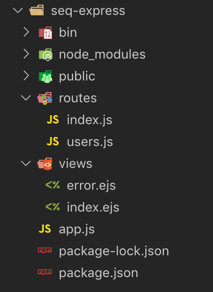
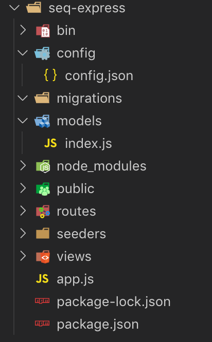
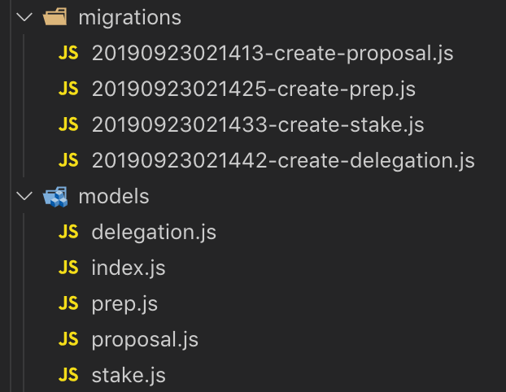
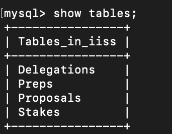
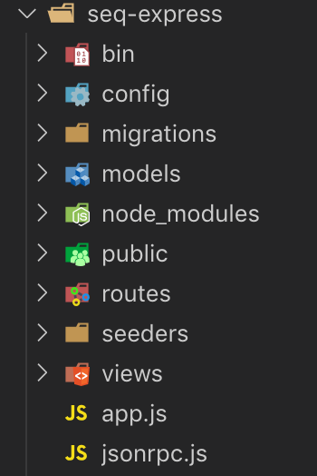

# IISS

Node.js와 Express, MySQL, JSON RPC 를 통한 IISS API 통신을 위한 더미 서버 구축

## 1. Express 프로젝트 생성

먼저, express-generator 모듈을 설치합니다.
```
$ npm install -g express-generator
```
다음, express-generator 모듈을 이용하여 프로젝트를 생성합니다.
```
$ express -e seq-express --view=ejs
$ cd seq-express
$ npm install
```
seq-express라는 이름의 프로젝트를 생성했고, view 엔진으로는 ejs를 사용하겠습니다.\
ejs에서는 태그를 통하여 html문서를 작성하고, 
<% %> 와 <%= %>를 이용하여 서버가 전달해준 값을 사용할 수 있습니다.




## 2. MySQL 연동

### ORM(Object Relational Mapping)
ORM은 프로그램 상의 객체를 DB 테이블과 1대1로 맵핑시켜줍니다. 또한, query가 아닌 method를 이용하여
데이터를 조작할 수 있다는 장점이 있습니다. method를 호출하면 내부적으로 query사 실행됩니다.\
여기서는 Node.js의 ORM인 seqeulize를 사용하겠습니다.

### Sequelize
Sequelize는 Node.js 기반의 ORM으로 Promise를 지원합니다. \
Sequelize를 사용하기 위해서 sequelize와 mysql이 아닌 mysql2 모듈을 설치합니다.\
또한, sequelize를 좀 더 효율적으로 사용할 수 있도록 해주는 sequelize-cli를 사용하기 위해 
sequelize-cli 모듈도 설치합니다.
```
$ npm install sequelize mysql2
$ npm install sequelize-cli
$ sequelize init
```
`seqeulize init`을 하면 다음과 같이 몇 개의 폴더와 파일이 새로 생성됩니다. 



/config/config.json\
config.json 파일에서는 DB와 연동을 하기 위한 환경설정을 합니다.\
MySQL과 연동하기 위해 다음과 같이 바꾸어줍니다.
```
"development": {
    "username": "root",
    "password": "1234",
    "database": "IISS",
    "host": "localhost",
    "port": "3306",
    "dialect": "mysql",
    "operatorsAliases": false
  }
  ```

/models/index.js\
여기에서는 config.json 파일의 설정 값을 읽어 sequelize를 생성합니다.
models 폴더의 파일들을 모두 로딩하여 하나의 db 객체에 반환하는 역할을 합니다.

/app.js - sync()
models/index,js 에서 정의된 모델들을 실제 DB에 적용하여 테이블을 생성하기 위해서 
app.js에서 sync() 메소드를 호출해야 합니다.

  ```
const models = require("./models/index.js");

models.sequelize.sync().then( () => {
    console.log(" DB 연결 성공");
}).catch(err => {
    console.log("연결 실패");
    console.log(err);
});
```
이제 `npm start`를 통해 서버를 실행하면 모델이 등록되고 Sequelize가 연동됩니다.


## sequelize-cli 모델 정의
### 모델 정의
models 폴더에 직접 파일을 만들어서 모델을 정의할 수도 있지만 앞서 설치한 sequelize-cli를 이용하여
CLI에서 더 간편하게 모델을 정의할 수 있습니다. 사용 방법은 다음과 같습니다.
```
$ sequelize model:create --name TABLE_NAME --attribute "COLUMN_NAME:type"
```

#### IISS API List
- PRep
  - registerPRep
  - unregisterPRep
  - setPRep
  - getPRep
  - getPReps
- Stake
  - setStake
  - getStake
- Delegation
  - setDelegation
  - getDelegation
- Proposal
  - registerProposal
  - cancelProposal
  - voteProposal
  - getProposal
  - getProposals   

IISS API의 Prep, Stake, Delegation, Proposal을 위한 총 4개의 모델을 만들겠습니다.

```
$ seqeulize model:create --name Delegation --attributes "EOA:string, value:string, address:string"
$ seqeulize model:create --name Prep --attributes "EOA:string, name:string, email:string, website:string, country:string, city:string, details:string, p2pEndpoint:string"
$ seqeulize model:create --name Proposal --attributes "id:string, title:string, description:string, type:string, value:string, vote:string"
$ seqeulize model:create --name Stake --attributes "EOA:string, value:string"
```
이제 다음과 같이 models와 migrations 폴더에 파일들이 생상됩니다.\

\

서버를 실행하면 정의된 모델에 의해 테이블이 생성됩니다.\


확인 결과 4개의 테이블이 잘 생성되었습니다. 자세히 살펴보면 테이블명이 모두 복수형인데  sequelize-cli를 이용하면 자동으로 테이블명이 복수형으로 선언된다는 특징이 있습니다. 
또한 자동으로 id, createdAt updateAt 3개의 컬럼을 생성해줍니다.

### 옵션 설정
sequelize-cli로 모델을 생성하면 기본값으로 컬럼의 옵션들이 설정됩니다.
따라서 옵션을 변경하거나 제약조건을 추가해주는 작업이 필요합니다.

대표적으로 delegation을 통해 살펴보겠습니다.
먼저
/models/delegation.js 을 다음과 같이 변경해줍니다.
```
'use strict';
module.exports = (sequelize, DataTypes) => {
  const Delegation = sequelize.define('Delegation', {
    EOA: {
      type: DataTypes.STRING,
      allowNull: false,
      primaryKey: true
    },
    value: {
      type: DataTypes.STRING,
      allowNull: false
    },
    address: {
      type: DataTypes.STRING,
      allowNull: false
    },
  });
  Delegation.associate = function(models) {
    // associations can be defined here
  };
  return Delegation;
};
```
migrations 파일도 변경하여 models 파일의 정의와 일치시켜야합니다. 

/migrations/20190915040628-create-delegation.js 을 다음과 같이 바꾸어줍니다.
주의할 점은 migrations 파일에서는 `DataTypes` 대신에 `Sequelize`를 써주어야 합니다.

```
'use strict';
module.exports = {
  up: (queryInterface, Sequelize) => {
    return queryInterface.createTable('Delegations', {
      id: {
        allowNull: false,
        autoIncrement: true,
        primaryKey: true,
        type: Sequelize.INTEGER
      },
      EOA: {
        type: Sequelize.STRING,
        allowNull: false,
        primaryKey: true
      },
      value: {
        type: Sequelize.STRING,
        allowNull: false,
      },
      address: {
        type: Sequelize.STRING,
        allowNull: false,
      },
      createdAt: {
        allowNull: false,
        type: Sequelize.DATE
      },
      updatedAt: {
        allowNull: false,
        type: Sequelize.DATE
      }
    });
  },
  down: (queryInterface, Sequelize) => {
    return queryInterface.dropTable('Delegations');
  }
};
```
이제 migration을 해줘야 변경사항이 DB에 적용됩니다. 다음 명령어를 실행합니다.
```
sequelize db:migrate
```
만약 이미 migration 한 상태라면 다음을 실행하면 됩니다.
```
sequelize db:migrate:undo
```

## 3. Router, Controller, View 

### MVC 패턴 구축
express-generator를 통해 생성된 프로젝트의 폴더 구조를 MVC 패턴에 맞게 변형하겠습니다.\
seq_express 폴더 내에 app-server 폴더를 만들고, 이 폴더로 config, models, routes, views 폴더를 옮겨줍니다. 또한, controllers 폴더를 만들어줍니다. 라우터와 컨트롤러의 모듈화를 위해 routes와 controllers 폴더를 따로 두었습니다.
JSON RPC 서버와 IISS API를 구현할 jsonrpc.js 파일도 app.js 와 같은 경로에 생성했습니다.



routes와 view 의 경로가 변경되었기 때문에 app.js 에서도 해당 경로를 수정해야 합니다.

### Router
prep, stake, delegatoin, proposal 각각에 대한 라우터를 등록하기 위해\
routes 폴더 밑에 prep.js stake.js, delegation.js, proposal.js 파일을 생성합니다.
그리고 app.js 에 이 router 들을 등록해야 합니다. 다음과 같이 app.js 에 추가해 주었습니다.
```
$ var proposalRouter = require('./app_server/routes/proposal');
$ var prepRouter = require('./app_server/routes/prep');
$ var stakeRouter = require('./app_server/routes/stake');
$ var delegationRouter = require('./app_server/routes/delegation');

$ app.use('/proposal', proposalRouter);
$ app.use('/prep', prepRouter);
$ app.use('/stake', stakeRouter);
$ app.use('/delegation', delegationRouter);
```

먼저 routes/proposal.js를 살펴보겠습니다.
```
const express = require('express');
const router = express.Router();

router.get('/register', function(req, res, next){

});

router.post('/register', function(req, res, next){

});

router.get('/vote/:id', function(req, res, next){

});

router.put('/vote/:id', function(req, res, next){

});

router.delete('/cancel/:id', function(req, res, next){

});

router.get('/getProposal/:id', function(req, res, next){

});

router.get('/getProposals', function(req, res, next){

});

module.exports = router;
```
proposal에는 registerProposal, voteProposal, cancelProposal, getProposal, getProposals 기능이 있습니다.\
```router.get('/register', function(req, res, next){});```에서는 등록된 Proposal에 대한 기본 정보를 띄어주는 역할을 합니다.\
```router.post('/register', function(req, res, next){});```에서는 기본 정보를 입력하고 Proposal을 등록하는 역할을 합니다.
```router.get('/vote/:id', function(req, res, next){});```에서는 선택한 Proposal id에 대해 voteProposal을 위한 페이지로 이동을 하고\
```router.put('/vote/:id', function(req, res, next){});```에서 vote를 하게 됩니다.\
```router.delete('/cancel/:id', function(req, res, next){});```에서는 선택한 Proposal을 삭제합니다.\
```router.get('/getProposal/:id', function(req, res, next){});```에서는 선택한 Proposal에 대한 정보들을 가져와서 보여줍니다.\
```router.get('/getProposals', function(req, res, next){});```은 모든 Proposal에 대한 정보들을 보여줍니다.\
마지막으로 ```module.exports = router;``` 를 통해 router를 리턴해줍니다.

### Controller
위에서 작성한 routes/proposal.js 에서 바로 기능을 수행하는 로직을 만들어되 되지만 router와 controller를 따로 모듈화할 것입니다. 따라서 각 router 에서 수행될 controller를 controllers/proposalController.js 에 작성하겠습니다. 다음과 같이 만들어줍니다.

```
exports.registerProposal_get = function (req, res, next) {
    
};

exports.registerProposal_post = function (req, res, next) {
    
};

exports.voteProposal_get = function (req, res, next) {
    
};

exports.voteProposal_put = function (req, res, next) {
    
};

exports.cancelProposal_delete = function (req, res, next) {
    
};

exports.getProposal_get = function (req, res, next) {
    
};

exports.getProposals_get = function (req, res, next) {
    
};
```
exports 를 통해 리턴을 하고, 리턴된 controller 를 router 에서 사용할 수 있도록 routes/proposal.js 를 다음과 같이 바꾸어줘야 합니다.
```
const express = require('express');
const router = express.Router();

const proposal_controller = require('../controllers/proposalController');

router.get('/register', proposal_controller.registerProposal_get);

router.post('/register', proposal_controller.registerProposal_post);

router.get('/vote/:id', proposal_controller.voteProposal_get);

router.put('/vote/:id', proposal_controller.voteProposal_put);

router.delete('/cancel/:id', proposal_controller.cancelProposal_delete);

router.get('/getProposal/:id', proposal_controller.getProposal_get);

router.get('/getProposals', proposal_controller.getProposals_get);

module.exports = router;
```

### View

view/proposal.ejs
```
<!DOCTYPE html>
<html lang="en">

<head>
    <meta charset="UTF-8">
    <title>Proposal</title>
</head>

<body>
    <h1>Proposal</h1>

    <form action="/proposal/register" method="POST" id="proposal">
        <table>
            <tr>
                <td><input type="text" name="title" placeholder="title"></td>
            </tr>
            <tr>
                <td><input type="text" name="description" placeholder="description"></td>
            </tr>
            <tr>
                <td><input type="text" name="type" placeholder="type"></td>
            </tr>
            <tr>
                <td><input type="text" name="value" placeholder="value"></td>
            </tr>
        </table>
        <input type="submit" value="registerProposal">
    </form>

    <button><a href="/proposal/getProposals">getProposals</a></button>

    <table>
        <% for(let Proposal of Proposals) { %>
        <tr>
            <td><%= Proposal.id %></td>
            <td><%= Proposal.title %></td>
            <td><%= Proposal.description %></td>
            <td><%= Proposal.type %></td>
            <td><%= Proposal.value %></td>
            <td><%= Proposal.vote %></td>
            <td><button><a href="/proposal/vote/<%= Proposal.id %>">vote</a></button></td>
            <td><button type="submit" formaction="/proposal/cancel/<%= Proposal.id %>?_method=DELETE"
                    form="proposal">cancel</button></td>
            <td><button><a href="/proposal/getProposal/<%= Proposal.id %>">getProposal</a></button></td>
        </tr>
        <% } %>
    </table>

</body>
</html>
```

view/voteProposal.ejs
```
<!DOCTYPE html>
<html lang="en">
<head>
    <meta charset="UTF-8">
    <title>Document</title>
</head>
<body>
<h1>vote</h1>

<form action="/proposal/vote/<%= id %>?_method=PUT" method="post">
    <input type="text" name="vote" placeholder="vote">
    <input type="submit" value="전송하기" >
</form>

</body>
</html>
```

view/getProposal.ejs
```
<!DOCTYPE html>
<html lang="en">
<head>
    <meta charset="UTF-8">
    <title>Document</title>
</head>
<body>
<h1>getProposal</h1>

<table>
    <tbody>
        <tr>
            <th scope="row">proposer</th>
            <td><%= Proposal.proposer %></td>
        </tr>
        <tr>
            <th scope="row">id</th>
            <td><%= Proposal.id %></td>
        </tr>
        <tr>
            <th scope="row">status</th>
            <td><%= Proposal.status %></td>
        </tr>
        <tr>
            <th scope="row">startBlockHeight</th>
            <td><%= Proposal.startBlockHeight %></td>
        </tr>
        <tr>
            <th scope="row">endBlockHeight</th>
            <td><%= Proposal.endBlockHeight %></td>
        </tr>
        <tr>
            <th scope="row">voter_agree_address</th>
            <td><%= Proposal.voter.agree.address %></td>
        </tr>
        <tr>
            <th scope="row">voter_agree_amount</th>
            <td><%= Proposal.voter.agree.amount %></td>
        </tr>
        <tr>
            <th scope="row">voter_disagree_address</th>
            <td><%= Proposal.voter.disagree.address %></td>
        </tr>
        <tr>
            <th scope="row">voter_disagree_amount</th>
            <td><%= Proposal.voter.disagree.amount %></td>
        </tr>
        <tr>
            <th scope="row">voter_noVote_address</th>
            <td><%= Proposal.voter.noVote.address %></td>
        </tr>
        <tr>
            <th scope="row">voter_noVote_amount</th>
            <td><%= Proposal.voter.noVote.amount %></td>
        </tr>
        <tr>
            <th scope="row">contents_description</th>
            <td><%= Proposal.contents.description %></td>
        </tr>
        <tr>
            <th scope="row">contents_type</th>
            <td><%= Proposal.contents.type %></td>
        </tr>
        <tr>
            <th scope="row">contents_value_address</th>
            <td><%= Proposal.contents.value.address %></td>
        </tr>
    </tbody>    
</table>

</body>
</html>
```

view/getProposals.ejs
```
<!DOCTYPE html>
<html lang="en">
<head>
    <meta charset="UTF-8">
    <title>Document</title>
</head>
<body>
<h1>getProposals</h1>

<table>
    <% for(let Proposal of Proposals) { %>
        <tr>
            <th scope="row">id</th>
            <td><%= Proposal.id %></td>
        </tr>
        <tr>
            <th scope="row">description</th>
            <td><%= Proposal.description %></td>
        </tr>
        <tr>
            <th scope="row">type</th>
            <td><%= Proposal.type %></td>
        </tr>
        <tr>
            <th scope="row">status</th>
            <td><%= Proposal.status %></td>
        </tr>
        <tr>
            <th scope="row">startBlockHeight</th>
            <td><%= Proposal.startBlockHeight %></td>
        </tr>
        <tr>
            <th scope="row">endBlockHeight</th>
            <td><%= Proposal.endBlockHeight %></td>
        </tr>
    <% } %>
</table>

</body>
</html>
```

## JSON RPC
JSON RPC 서버를 구축하여 API를 만들고 controller에서 호출하도록 만들겠습니다. view 를 통해 사용자에게서 입력 받은 값을 controller 에서 JSON RPC 서버로 보내기 위한 JSON 형식으로 만들어줍니다. icx_sendTransaction 과 icx_call 로 나뉘고, 그 안에서 registerPropsosal 등 해당되는 메소드를 실행하여 DB 와 통신하고 결과를 controller 로 리턴하여 view 에서 띄워주도록 할 것입니다.

### json-rpc2
먼저, json-rpc2 모듈을 사용하기 위해 설치하겠습니다.
```
npm install json-rpc2 --save
```
사용방법은 다음과 같습니다. jsonrpc.js 에 다음을 추가해줍니다.
```
const rpc = require("json-rpc2");

const server = rpc.Server.$create({
  websocket: true, 
  headers: {
    "Access-Control-Allow-Origin": "*",
    "Access-Control-Allow-Methods": "GET,PUT,POST,DELETE,OPTIONS",
    "Access-Control-Allow-Headers": "Content-Type, Authorization, Content-Length, X-Requested-With",
    'Content-Type': 'application/json'
  }
});

function icx_call(args, opt, callback) {

}

server.expose("icx_call", icx_call);

function icx_sendTransaction(args, opt, callback) {

}

server.expose("icx_sendTransaction", icx_sendTransaction);

server.listen(8888, "localhost");
```

IISS API 를 먼저 icx_call 과 icx_sendTransaction 으로 나눕니다. controller 에서 만든 json object를 각 function 의 args 로 받아옵니다. 다음 각각에 해당하는 method 를 실행합니다. sequelize 를 사용하여 DB 에 값을 넣거나 받아오고, 결과 값을 callback 을 통해 리턴해줘야 합니다. 

대표적으로 registerProposal 을 살펴보겠습니다. 

controllers/proposalController.js 의 다음 부분 네에 코드를 작성하겠습니다.
```
exports.registerProposal_post = function (req, res, next) {
    
};
``` 
먼저, router 를 통해 사용자로부터 입력받은 값을 토대로 다음과 같이 JSON RPC 로 넘겨줄 json 을 생성합니다.
```
let body = req.body;

    let args = {
        "jsonrpc": "2.0",
        "id": 1234,
        "method": "icx_sendTransaction",
        "params": {
            "version": "0x3",
            "from": "hx8f21e5c54f006b6a5d5fe65486908592151a7c57",
            "to": "cx0000000000000000000000000000000000000001",
            "stepLimit": "0x12345",
            "timestamp": "0x563a6cf330136",
            "nid": "0x3",
            "nonce": "0x0",
            "value": "0x0",
            "signature": "VAia7YZ2Ji6igKWzjR2YsGa2m5...",
            "dataType": "call",
            "data": {
                "method": "registerProposal",
                "params": {
                    "title": body.title,
                    "description": body.description,
                    "type": body.type,
                    "value": body.value,
                }
            }
        }
    };
```
다음 JSON RPC 를 호출하여 json 을 넘겨주는 방법은 간단합니다. 
```
const rpc = require('json-rpc2');
const client = rpc.Client.$create(8888, 'localhost');
```
먼저 파일 상단에 위 코드를 작성해주어야 합니다. 그리고 다음과 같이 ```client.call()``` 을 통해 서버의 함수를 호출해 실행합니다. 
```
client.call(args.method, args, function (err, result) {
    if (err) {
        console.log(err);
    }
    console.log(result);
});
```

args.method 가 icx_sendTrancsactoin 이므로 jsonrpc.js 의 icx_sendTransaction 함수에 registerProposal 을 실행하는 로직을 작성하겠습니다. 

DB 와 연결이 필요하고 reigsterProposal 에서는 해시값인 id 가 필요하므로 이에 필요한 몇가지 모듈을 jsonrpc.js 상단에 먼저 다음과 같이 추가하도록 하겠습니다.
```
const models = require('./app_server/models');
const {
  Keccak
} = require('sha3');
const hash = new Keccak(256);
```
그리고 icx_sendTransaction 에서 사용할 변수들을 선언합니다.
```
let _params = args.params;
let method = _params.data.method;

let params = _params.data.params;

let result;
```

그리고 메소드가 여러 개 있기 떄문에 switch-case 를 사용하여 메소드 이름으로 case 를 나누도록 하겠습니다.\
다음, sequelize 를 사용하여 DB 에 값을 insert 하고, 결과 값을 callback 으로 리턴해주는 코드입니다.

```
switch (method) {
    case "registerProposal":
        hash.update(JSON.stringify(args));
        let _id = "0x" + hash.digest('hex');

        try {
            result = models.sequelize.transaction(async () => {
                    return await models.Proposal.create({
                        id: _id,
                        title: params.title,
                        description: params.description,
                        type: params.type,
                        value: params.value,
                    }, result);
                })
                .then(result => {
                    console.log("데이터 추가 완료");
                    callback(null, result.dataValues);
                })
        } catch (err) {
            console.log(err);
            console.log("데이터 추가 실패");
        };

        break;
```
```hash.update(JSON.stringify(args));```, ```hash.digest('hex');``` 을 통해 해시값을 만들고 "0x" 를 앞에 추가하여 형식을 맞춰주었습니다.
다음, async/await 를 사용하여 sequelize 를 통해 DB 에 값이 모두 입력되면 그 결과 값을 result 로 받아오게 했습니다. 그 다음에 json object 값인 result.dataValues 를
callback 함수의 인자로 넘겨주어 controller 로 리턴해줍니다. 

 이 과정이 모두 끝나고 나면 ```client.call()``` 내부에 ```res.redirect("/proposal/register");``` 을 추가하여 페이지를 리디렉트 해줍니다. /proposal/register 로 리디렉트가 되면 
 ```registerProposal_get``` controller 가 작동하여 위와 비슷한 과정을 거쳐 등록된 proposal 들에 대한 정보들을 띄워줍니다. 


